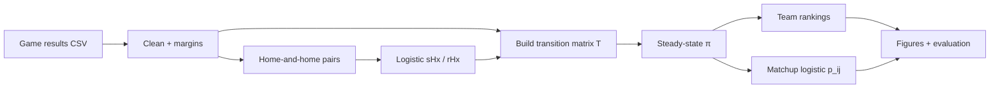

# NCAA Markov Ranking

This repository is a modern Python reimplementation of an analytics project originally completed during my graduate studies at Cornell University.

In grad school, my team built a logistic regression / Markov chain (LRMC) model to rank NCAA Division I men’s basketball teams and predict tournament games, following the approach in Kvam & Sokol (2006). We worked from regular-season results, fit logistic models on score margins, built a transition matrix across teams, and ranked teams by steady-state probability.

This repo recreates that workflow in Python. The original project used Sports Reference data with MATLAB, Excel, and Java, not this codebase.

## What this is meant to show

This is a portfolio analytics project, not a product and not a claim that I am a full-time software engineer.

If you only have a minute, the point is:

- I can take a quantitative method (logistic regression + a Markov chain) and turn it into a runnable pipeline: data in, rankings and charts out.
- I can explain the model, not just the output: why a score margin becomes a probability, why that probability becomes a transition, and why the long-run distribution is a ranking.
- I treat results as data-dependent. The Cornell paper has its own fitted numbers and tournament accuracy. This repo refits on whatever games you load. The bundled demo uses synthetic teams so the code runs immediately. It is not a 2003 tournament leaderboard.

I use this next to an operations project (Atlanta airport delays) and product work (CRWLR). Together they are meant to read as: models, operations decisions, and product-building, not three copies of the same app.

## What the model does

Public rankings (AP, RPI, seeds) compress a season into an ordering. LRMC is more explicit about the path from game results to that ordering:

1. Start from game-level scores and home/away margins.
2. Use home-and-home matchups to estimate how a home margin maps to the chance that one team is actually better.
3. Turn those probabilities into a Markov transition matrix over teams.
4. Rank by the steady-state distribution $\pi$.
5. Optionally map $\pi$ gaps to matchup win probabilities and check how often the higher-ranked team wins.

## Method (short version)

**Margin logistic.** For teams that play once at each home court, let $s^H_x$ be the probability that team A also wins the return game on the road, given that A beat B by $x$ points at home. Fit that with logistic regression:

$$
\ln\left(\frac{s^H_x}{1-s^H_x}\right) = ax + b
$$

which is the same as:

$$
s^H_x = \frac{e^{ax+b}}{1+e^{ax+b}}
$$

**Neutral-court adjustment.** Tournament games are closer to neutral sites. With home-court factor $h = 2$ (same as the original study), the probability that the home team is the better team given margin $x$ is:

$$
r^H_x = s^H_{x+h}
$$

**Transitions.** Each game contributes weights based on $r^H_x$. Rows of the transition matrix $T$ are normalized so each row sums to 1.

**Steady state.** Rank teams from the stationary distribution:

$$
\pi T = \pi, \quad \sum_i \pi_i = 1
$$

A larger $\pi_i$ means a higher rank for team $i$.

**Matchup logistic.** When useful for evaluation, fit home-win probability on the steady-state gap $\pi_{\mathrm{home}} - \pi_{\mathrm{away}}$:

$$
P(\mathrm{home\ win}) = \frac{1}{1 + e^{-(a(\pi_{\mathrm{home}} - \pi_{\mathrm{away}}) + b)}}
$$

Coefficients are fit on whatever dataset you load. The paper's reported values $a \approx 0.0504$, $b \approx 0.8052$ are fallbacks only if there are not enough home-and-home pairs.



## Layout

```
ncaa-markov-ranking/
├── data/
│   ├── sample/demo_season.csv      # synthetic demo
│   ├── sample/games_template.csv   # schema example for your data
│   └── raw/                        # optional Kaggle files (gitignored)
├── src/                         # loader, features, logistic, Markov, rankings
├── scripts/run_pipeline.py
├── notebooks/analysis.ipynb
├── outputs/                     # rankings, summary, figures
└── tests/
```

## Data

The Cornell project used Sports Reference schedules from roughly 1999-2003. Those files are not redistributed here. This repo is set up so you can run it on **your own game results**.

### Option A: your own CSV (recommended)

Create a CSV with these columns (see `data/sample/games_template.csv`):

| Column | Required | Description |
| --- | --- | --- |
| `season` | yes | Season year (integer), e.g. `2024` |
| `home_team` | yes | Home team name or ID |
| `away_team` | yes | Away team name or ID |
| `home_score` | yes | Home points |
| `away_score` | yes | Away points |
| `neutral` | no | `true`/`false` if the game was at a neutral site (default `false`) |

Example:

```csv
season,home_team,away_team,home_score,away_score,neutral
2024,Duke,North Carolina,80,75,false
2024,North Carolina,Duke,70,68,false
```

Then run:

```bash
python scripts/run_pipeline.py --path /path/to/your_games.csv
python scripts/run_pipeline.py --path /path/to/your_games.csv --season 2024
python scripts/run_pipeline.py --path /path/to/your_games.csv --out-dir outputs/my_run
```

Tips for better rankings:

- Include a full regular season (or as complete as you can), not only a few games.
- Home-and-home pairs (each team hosts the other once) improve the margin logistic fit. If those pairs are scarce, the code falls back to the paper's published coefficients for $r^H_x$.
- Team names must be consistent across rows (`Duke` and `duke` are treated as different teams).

### Option B: Kaggle March Madness files

Download the compact results (and optionally team names) from a March Machine Learning Mania competition, then either:

```bash
# put files in data/raw/
#   MRegularSeasonCompactResults.csv
#   MTeams.csv
python scripts/run_pipeline.py --season 2003
```

or pass paths explicitly:

```bash
python scripts/run_pipeline.py \
  --path /path/to/MRegularSeasonCompactResults.csv \
  --teams /path/to/MTeams.csv \
  --season 2003
```

Large raw files under `data/raw/` are gitignored.

### Option C: bundled demo

With no `--path` and no files in `data/raw/`, the pipeline runs on `data/sample/demo_season.csv` (synthetic data for a smoke test only).

## Results

### From the original Cornell report

On late-1990s / early-2000s data (not the demo below):

- Margin logistic roughly $(a, b) \approx (0.0504, 0.8052)$ with $h = 2$
- About **63%** of same-year NCAA tournament games predicted correctly across the years we tabulated
- About **68%** when using one season’s model on the next tournament
- We also compared predicted Final Four point spreads (e.g. 2000) to actual margins

### From this Python pipeline (demo only)

Smoke test on the synthetic 12-team / 72-game season:

- Re-fit margin logistic: $a \approx 0.160$, $b \approx -1.552$
- Higher-$\pi$ favorite correct on **56/72** regular-season games (**77.8%**)
- Details in `outputs/run_summary.json`

Those demo numbers are not NCAA historical results. On your own data, the fitted coefficients and accuracy will be whatever that run produces.

## Charts

`scripts/run_pipeline.py` writes four plots to `outputs/figures/` (or `--out-dir`):

1. Home score-margin histogram
2. Logistic fit for road-win probability vs home margin
3. Top teams by steady-state $\pi$
4. Home win rate vs $\pi$ differential

## Run it

```bash
python3 -m venv .venv
source .venv/bin/activate
pip install -r requirements.txt

# 1) Smoke test (synthetic)
python scripts/run_pipeline.py

# 2) Your data
python scripts/run_pipeline.py --path data/sample/games_template.csv

# 3) Kaggle season (after placing CSVs in data/raw/)
python scripts/run_pipeline.py --season 2003

pytest -q
```

There is also a short walkthrough in `notebooks/analysis.ipynb`.

## Stack

Python 3, pandas, numpy, scikit-learn, matplotlib, pytest. Steady state is solved with NumPy least squares.

## Why I keep this around

The useful part is still the chain you can point at: a game, a probability, a matrix entry, a ranking. If that chain is clear, the repo did its job.
